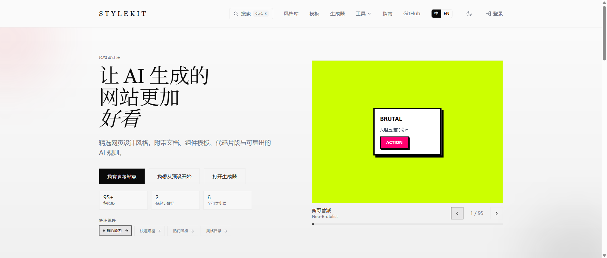

<p align="center">
  <a href="https://stylekit.top">
    <picture>
      <source media="(prefers-color-scheme: dark)" srcset="public/readme/logo-dark.svg">
      <source media="(prefers-color-scheme: light)" srcset="public/readme/logo-light.svg">
      
    </picture>
  </a>
</p>

<p align="center">
  <strong>Open-source visual styles, tokens, and AI prompts for less generic AI-generated UI.</strong><br>
  136 curated styles — install a shadcn theme or use its constraints in Cursor, Claude Code, v0, or Windsurf. English &amp; 中文 style discovery.
</p>

<p align="center">
  <a href="https://stylekit.top"></a>
  <a href="https://github.com/AnxForever/stylekit/stargazers"></a>
  <a href="LICENSE"></a>
  <a href="https://nextjs.org"></a>
  <a href="https://www.typescriptlang.org"></a>
</p>

<br>

<p align="center">
  <a href="https://stylekit.top">
    
  </a>
</p>

<p align="center">
  <a href="https://stylekit.top/styles"><strong>Showcase</strong></a> &middot;
  <a href="https://stylekit.top/templates"><strong>Templates</strong></a> &middot;
  <a href="https://stylekit.top/animations"><strong>Animations</strong></a> &middot;
  <a href="#contributing"><strong>Contributing</strong></a>
</p>

<br>

---

## What is StyleKit?

StyleKit helps humans and AI start from a consistent visual direction. Pick a style to get structured design tokens, component recipes, prompt guidance, and implementation references; production integration and completeness still depend on the target project.

<table>
<tr>
<td width="50%" valign="top">

### Design System

- **136 visual and layout styles** with design tokens, color palettes, and typography
- **136 live showcases** — full-page interactive demos across the catalog
- **Component recipes** — copy-paste code for buttons, cards, inputs, and more
- **Export anywhere** — Tailwind preset, shadcn theme, CSS variables, Figma tokens

</td>
<td width="50%" valign="top">

### AI-Native Workflow

- **AI implementation guidance** — hard prompt, design spec, and creative brief
- **IDE export** — `.cursorrules`, `claude-rules`, `windsurf-rules`
- **shadcn theme install** — light and dark CSS variables for existing projects
- **llms.txt** — AI-discoverable docs at [`/llms.txt`](https://stylekit.top/llms.txt)

</td>
</tr>
<tr>
<td width="50%" valign="top">

### Creative Tools

- **57 animations** with live preview and one-click copy
- **35 page-template demos** — SaaS, dashboard, e-commerce, portfolio, blog
- **Prompt libraries** — copyable UI, landing page, dashboard, Tailwind, and dark mode prompts
- **Design resources** — gradients, shadows, backgrounds, typography, and component patterns

</td>
<td width="50%" valign="top">

### Platform

- **Bilingual** — full English and Chinese support
- **Localized routing** — English and Chinese public pages
- **LLM-readable docs** — `/llms.txt`, `/llms.md`, and `/llms-full.txt`
- **Production runbooks** — deployment, release review, and style authoring docs

</td>
</tr>
</table>

## Styles

136 styles across multiple visual and layout categories. Every style includes design tokens, component code, AI rules, and a curated preview.

<details>
<summary><strong>Modern / Tech</strong> — Glassmorphism, Liquid Glass, Neumorphism, Bento Grid, Fluent Design, Material Design, Linear Style ...</summary>

Clean, professional styles for SaaS products, dashboards, and developer tools. Emphasis on subtle depth, blur effects, and systematic spacing.

</details>

<details>
<summary><strong>Brutalist</strong> — Neo-Brutalist, Neo-Brutalist Playful, Neo-Brutalist Soft, Brutalist Web, Anti-Design</summary>

Bold borders, raw typography, high contrast. Ranges from aggressive to playful depending on the variant.

</details>

<details>
<summary><strong>Brand-Inspired</strong> — Apple Style, Stripe Style, Notion Style, GitHub Style, Shopify Clean, Linear Style</summary>

Reverse-engineered design languages from iconic products. Great starting points for product UI.

</details>

<details>
<summary><strong>Retro / Vintage</strong> — Art Deco, Vaporwave, VHS Aesthetic, Y2K, Outrun, Synthwave, Retro Vintage, Frutiger Aero</summary>

Nostalgic aesthetics spanning decades. From 1920s Art Deco to 2000s Y2K and Frutiger Aero.

</details>

<details>
<summary><strong>Artistic</strong> — Watercolor, Impressionist Oil, Pop Art, Risograph, Collage Art, Ink Wash, Generative Art</summary>

Fine art movements translated into UI design. Painterly textures, halftone patterns, and organic forms.

</details>

<details>
<summary><strong>Japanese / Anime</strong> — Ghibli Style, Cyber Anime, Shoujo Manga, Ukiyo-e, Pixel Anime, Neon Samurai, Kawaii Minimal</summary>

Japanese visual culture from traditional woodblock prints to modern anime aesthetics.

</details>

<details>
<summary><strong>Cyberpunk / Sci-Fi</strong> — Cyberpunk Neon, Neon Tokyo, Sci-Fi HUD, Mecha, Holographic, Arcade CRT</summary>

Neon-drenched, high-tech interfaces. Terminal greens, scan lines, and holographic effects.

</details>

<details>
<summary><strong>Layout Patterns</strong> — Magazine Grid, Masonry Flow, Split Screen, Parallax, Dashboard Layout, Holy Grail, F-Pattern, Z-Pattern</summary>

Structural patterns that pair with any visual style. Responsive grids, scroll-based layouts, and classic page structures.

</details>

<details>
<summary><strong>Cultural / Regional</strong> — Islamic Geometric, Indian Festive, African Textile, Korean Minimal, Cyber Chinese, Dark Academia</summary>

Design traditions from around the world, adapted for modern web interfaces.

</details>

<details>
<summary><strong>Nature / Cozy</strong> — Cottagecore, Scandinavian, Wabi-Sabi, Natural Organic, Solarpunk, Zen Garden, Tropical Paradise</summary>

Warm, organic, and calming. Earthy palettes, soft textures, and generous whitespace.

</details>

<p align="center">
  <a href="https://stylekit.top/styles"><strong>Browse all styles &rarr;</strong></a>
</p>

## Quick Start

```bash
git clone https://github.com/AnxForever/stylekit.git
cd stylekit
pnpm install
pnpm dev
```

Open [localhost:3000](http://localhost:3000). See [`.env.example`](.env.example) for optional Supabase and admin configuration.

## Project Structure

See [`docs/PROJECT_STRUCTURE.md`](docs/PROJECT_STRUCTURE.md) for the repository map, runtime flow, source boundaries, and cleanup guidance.
See [`docs/STYLE_AUTHORING.md`](docs/STYLE_AUTHORING.md) before adding or changing catalog styles.
See [`docs/DEPLOYMENT.md`](docs/DEPLOYMENT.md) and [`docs/RELEASE_REVIEW.md`](docs/RELEASE_REVIEW.md) for production deployment and release review notes.

## API Surface

The stable JSON endpoints expose published style metadata, tokens, recipes, and rules.

```
GET  /api/styles                      # List all styles
GET  /api/styles/{slug}               # Style record (tokens + recipes + rules)
GET  /api/styles/{slug}/tokens        # Design tokens only
GET  /api/styles/{slug}/recipes       # Component recipes only
```

## Use in your shadcn project

Every style is also published as a [shadcn registry](https://ui.shadcn.com/docs/registry) theme. Install any style's light + dark color theme into an existing shadcn project with one command:

```bash
npx shadcn add https://stylekit.top/r/glassmorphism.json
```

Swap `glassmorphism` for any slug — browse the full list at [`/registry.json`](https://stylekit.top/registry.json) or in the [styles gallery](https://stylekit.top/styles). The CLI injects the style's `cssVars` (light + dark) into your `globals.css` and works with Tailwind v4.

> Prerequisite: the target project must contain a `tsconfig.json`, or the shadcn CLI exits with `Couldn't find tsconfig.json`.

See [`docs/registry.md`](docs/registry.md) for the full guide.

## Use as an Agent Skill

Give Cursor, Claude Code, Windsurf, or any Agent-Skills-compatible coding agent
built-in knowledge of StyleKit — how to browse styles and install them — with
one command:

```bash
npx skills add AnxForever/stylekit
```

Your agent can then apply any of the 136 styles on request ("make this look
like Stripe", "cyberpunk dashboard") using the correct tokens and rules. The
skill lives in [`SKILL.md`](SKILL.md); see [`docs/AGENT_SKILL_GUIDE.md`](docs/AGENT_SKILL_GUIDE.md)
for how it's built and published.


## Support This Project

If StyleKit happens to help you, that honestly means a lot.

You can support the project with any amount you like. It helps keep StyleKit going and offsets server, domain, and maintenance costs.

For Chinese readers:

> 如果 StyleKit 恰好帮到了你，欢迎扫码支持我把它继续做下去。金额随意，每一份心意我都很感谢。

- Tip via WeChat or Alipay on the website support page
- GitHub repo funding entry: [`https://github.com/AnxForever/stylekit`](https://github.com/AnxForever/stylekit)
- Website support page: [`https://stylekit.top/contact#support-maintenance`](https://stylekit.top/contact#support-maintenance)
- Public sponsor follow-up: [`GitHub Discussions`](https://github.com/AnxForever/stylekit/discussions)

Current QR assets:

- Alipay: [`public/alipay-qr.jpg`](public/alipay-qr.jpg)
- WeChat Tipping: [`public/wechat-qr.png`](public/wechat-qr.png)

The website support section is driven from a single config file: [`lib/site/support.ts`](lib/site/support.ts).

## Tech Stack

| Layer | Technology |
|-------|-----------|
| Framework | Next.js 16 + Turbopack |
| UI | React 19, Radix UI, Lucide Icons |
| Styling | Tailwind CSS 4, CVA |
| Auth & DB | Supabase (PostgreSQL + auth helpers) |
| Validation | Zod 4 |
| Testing | Vitest + Playwright |
| Deployment | Alibaba Cloud ECS + Nginx + PM2 |

## Production Deployment

Current production for `www.stylekit.top` runs on an Alibaba Cloud ECS instance in Beijing.

- Edge and TLS: Nginx on the ECS host
- App process: PM2 app `stylekit`
- App directory: `/www/stylekit` rsynced from a verified local checkout
- Runtime command: `pnpm start --hostname 0.0.0.0 --port 13000`

`vercel.json` is no longer part of the active production deployment path and should not be treated as the source of truth for where StyleKit is hosted.

See [`docs/DEPLOYMENT.md`](docs/DEPLOYMENT.md) for the deployment runbook, healthcheck watchdog setup, admin login checks, and rollback commands.

## Contributing

Contributions welcome. Please read these before opening a PR:

1. [`CONTRIBUTING.md`](docs/CONTRIBUTING.md)
2. [`STYLE_ADDITION_CHECKLIST.md`](docs/STYLE_ADDITION_CHECKLIST.md) — required for new styles

```bash
git checkout -b feat/your-feature
pnpm lint && pnpm test && pnpm build
git commit -m "feat: add your feature"
```

## Star History


## Contributors

<a href="https://github.com/AnxForever/stylekit/graphs/contributors">
  
</a>

## License

MIT — see [LICENSE](LICENSE).

---

<p align="center">
  <a href="https://stylekit.top"><strong>www.stylekit.top</strong></a>
  <br>
  Built by <a href="https://github.com/AnxForever">AnxForever</a>
</p>
