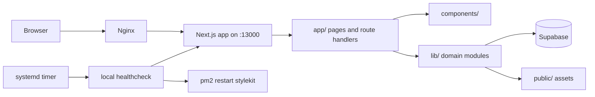

# StyleKit Project Structure

This document is a practical map of the repository. It describes the current source layout, the runtime boundaries, and the directories that should be treated as generated output or external working material.

## Overview

StyleKit is a Next.js App Router application with a large design-style catalog, template/resource galleries, validation tooling, authenticated admin features, and a small publishable core package.

Main runtime stack:

- Next.js 16, React 19, TypeScript
- App Router under `app/`
- Supabase for auth and persistence-backed features
- PM2 + Nginx on the current production host
- Vitest for unit tests, Playwright for end-to-end tests

## Source Map

```text
.
├── app/                    Next.js routes, layouts, route handlers, metadata
├── components/             React UI components grouped by feature/surface
├── lib/                    Domain logic, data models, registries, services
├── content/                MDX/blog content
├── public/                 Static assets used by the app
├── packages/core/          Publishable @stylekit/core package
├── tools/                  Local validation and utility scripts
├── tests/                  Vitest unit tests and Playwright e2e tests
├── docs/                   Project documentation and product/process notes
├── ops/                    Production operations scripts and systemd units
├── dist-skills/            Generated or exported skill pack artifacts
└── style-extractor-dev/    External/experimental sub-project, not app runtime code
```

## Runtime Flow



## `app/`

`app/` owns route composition and HTTP boundaries.

Important groups:

- `app/page.tsx`, `app/[locale]/page.tsx`: home entry points.
- `app/[locale]/...`: localized public pages.
- `app/styles/`: style catalog pages and style detail/showcase routes.
- `app/templates/`: template gallery and individual template routes.
- `app/animations/`, `app/backgrounds/`, `app/gradients/`, `app/shadows/`, `app/typography/`: design resource surfaces.
- `app/admin/`: admin UI pages.
- `app/login/`: auth entry point. Profile, community, generator, playground, analysis, comparison, migration, and pipeline routes are hidden or redirected.
- `app/api/`: route handlers for JSON APIs, auth callbacks, admin APIs, linting, style export, health checks, and retired endpoint responses.

Pattern in use:

- Page files stay mostly as route wrappers.
- Larger client/server UI is usually split into `_content.tsx` colocated with route folders or feature components in `components/`.
- Public API handlers delegate to `lib/` modules where possible.

## `components/`

`components/` is organized by feature area rather than by atomic design level.

Main categories:

- `components/layout/`: global shell, header, footer, mobile nav, user menu.
- `components/home/`: homepage sections.
- `components/styles/`, `components/style-preview/`, `components/showcase/`: style browsing and style detail UI.
- `components/templates/`, `components/animations/`: primary product tools.
- `components/admin/`: shared admin shell and admin primitives.
- `components/ui/`: reusable low-level primitives and styled UI variants.
- `components/providers/`, `components/pwa/`, `components/analytics/`: app-wide client integrations.

Rule of thumb:

- Put route-specific composition in `app/**/_content.tsx`.
- Put reusable feature UI in `components/<feature>/`.
- Put generic primitives in `components/ui/`.

## `lib/`

`lib/` is the main domain and service layer.

Key modules:

- `lib/styles/`: style metadata, tokens, registries, scenarios, lint rules, style blending.
- `lib/recipes/`: component recipe definitions and rendering.
- `lib/animations/`: animation catalog and helpers.
- `lib/templates/`, `lib/backgrounds/`, `lib/gradients/`, `lib/shadows/`, `lib/typography/`: design resource data.
- `lib/auth/`: Supabase auth, admin access, sessions, user title policy.
- `lib/supabase/`: server clients and migrations.
- `lib/admin/`: admin analytics/audit utilities.
- `lib/community/`, `lib/favorites/`, `lib/profile`-adjacent modules: hidden user/community behavior used by style runtime/admin surfaces.
- `lib/generator/`: internal scaffold/rendering helpers still used by submission registration; not a public generator product.
- `lib/linter/`, `lib/quality/`, `lib/accessibility/`: linting and scoring engines.
- `lib/export/`: export formats such as Tailwind preset, shadcn theme, Figma tokens, IDE rules, skill packs.
- `lib/i18n/`: locale routing, metadata, translations, request helpers.
- `lib/security/`, `lib/seo/`, `lib/rss/`, `lib/og/`: cross-cutting platform support.

The heaviest domain is the style catalog. `lib/styles` and `lib/recipes` should be treated as catalog data plus small helper APIs; route handlers and UI should consume them instead of duplicating catalog knowledge. The public entry points stay `@/lib/styles`, `@/lib/styles/meta`, `@/lib/styles/recipes`, `@/lib/styles/tokens-registry`, and `@/lib/recipes`, while `lib/styles/registry.ts`, `lib/styles/meta-registry.ts`, `lib/styles/recipe-registry.ts`, `lib/styles/tokens-registry-data.ts`, and `lib/recipes/registry.ts` hold the internal catalog registration lists.

## `packages/core/`

`packages/core` is a separate package intended to publish StyleKit primitives outside the website.

Source lives in:

- `packages/core/src/styles`
- `packages/core/src/recipes`
- `packages/core/src/linter`
- `packages/core/src/knowledge`
- `packages/core/src/accessibility`
- `packages/core/src/quality`

Generated package output lives in `packages/core/dist`. It is ignored by `.gitignore` and should not be treated as application source.

## `tools/`

`tools/` contains local developer tooling:

- `tools/scripts/`: checks, audits, migration/refinement scripts.
- `tools/submission/`: submission manifest validation.

These scripts are operational/developer tools, not production route code.

## `tests/`

Test layout:

- `tests/unit/app/`: route handler and app-level unit tests.
- `tests/unit/lib/`: domain and utility tests.
- `tests/e2e/`: Playwright browser tests.
- `tests/vitest.config.ts`, `tests/vitest.setup.ts`: Vitest setup.

Useful commands:

```bash
pnpm run typecheck
pnpm run test:run
pnpm run e2e
```

## `ops/`

`ops/` contains production operations material.

Current files:

- `ops/stylekit-healthcheck.sh`: local HTTP healthcheck with PM2 restart after repeated failures.
- `ops/systemd/stylekit-healthcheck.service`: one-shot watchdog service.
- `ops/systemd/stylekit-healthcheck.timer`: timer that runs the watchdog every minute.

The current production host uses Nginx to proxy `www.stylekit.top` to the Next.js app on `127.0.0.1:13000`.

## Generated And External Material

Do not use these directories as primary source when reading the project:

- `.next/`: Next.js build output.
- `node_modules/`: dependencies.
- `playwright-report/`, `test-results/`: test artifacts.
- `packages/**/dist/`: package build output.
- `.data/`: local runtime data.
- `docs/references/`: imported reference material.
- `style-extractor-dev/`: separate extractor workspace, not part of the main app runtime.

## Current Organization Notes

The repository is a modular monolith. That is the right shape for this product: many related feature surfaces share one catalog, one auth model, one deployment unit, and one Next.js runtime.

Areas that are already well separated:

- Public page composition (`app/`) is separate from shared UI (`components/`) and domain logic (`lib/`).
- Catalog data (`lib/styles`, `lib/recipes`) is separate from display surfaces (`app/styles`, `components/style-preview`).
- Admin UI and admin APIs have dedicated route groups.
- Tooling (`tools/`) and publishable package code (`packages/core/`) have distinct boundaries.

Areas that need clearer boundaries:

- Localized and non-localized routes coexist. Keep canonical behavior documented in `lib/i18n/routing.ts`.
- Some large showcase `_content.tsx` files are full feature implementations. For repeated patterns, extract shared showcase primitives into `components/showcase/`.
- `lib/styles` is still intentionally flat for individual style files. Keep broad file moves out of routine cleanup; use the internal registry files for registration changes and keep public entry points stable.
- Large imported reference folders should stay out of normal source review and search scopes.

## Suggested Cleanup Order

1. Keep generated and external directories ignored and out of code review: `.next`, reports, `packages/**/dist`, `style-extractor-dev`, `docs/references`.
2. Standardize route content splitting: route wrappers in `page.tsx`, substantial UI in `_content.tsx` or `components/<feature>/`.
3. Extract repeated showcase UI only when duplication is real; avoid broad catalog reshuffles.
4. Add dependency boundary checks later if the catalog continues growing.
